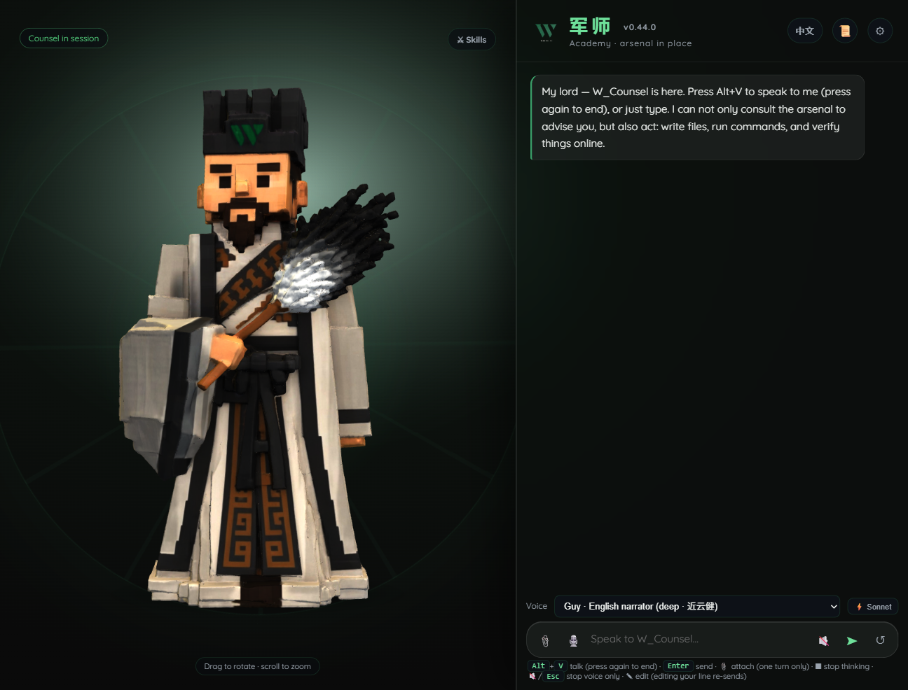
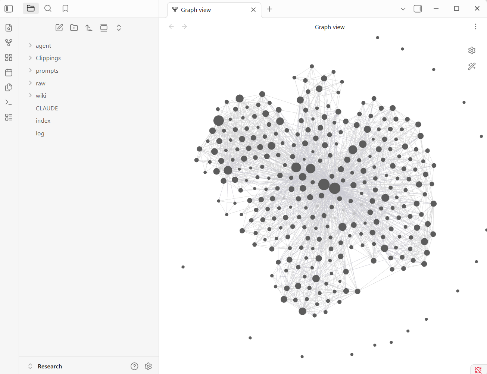

# AI Solopreneur OS

**Build your AI life without losing your soul.**
建立你的 AI 事业，守住你的灵魂。

A weekly operating system for a one-person business in the age of AI — run inside
[Claude Code](https://claude.com/claude-code). Not a course, not a pile of tools. A rhythm, and a
**W_Counsel (军师)** — a war-counsel — wired into your workspace, turning scattered effort into one
campaign you can actually sustain.

[-blue.svg)](./LICENSE)

---

## The shape of it

**Five pillars (五柱)** — the surfaces you operate from:

| 势 Terrain | 律 Rhythm | 令 Morning Command | 谋 Grand Strategy | 库 Arsenal |
|---|---|---|---|---|
| see the whole board | your daily cadence | issue the day's orders | the doctrine (below) | knowledge → build · story · content |

**Four loops (四谋)** — the doctrine you run every week, inside 谋:

- **知 Knowing** — know yourself, know the field; kill noise before you move.
- **阵 Formation** — build the structures that hold the line.
- **战 Campaign** — ship visible, real work into the arena, daily.
- **道 The Way** — hold to your cause; the through-line that keeps it all sustainable.

Read the full doctrine: [`framework/ai-solopreneur-os.md`](./framework/ai-solopreneur-os.md).

---

## Quickstart (about 20 minutes, mostly downloads)

**You need:** a **Claude Pro account (minimum)** and [VS Code](https://code.visualstudio.com/) with the
**Claude Code** extension. The OS runs on your Claude Code login — **no API key needed** for normal use.
No installer to run, nothing to configure.

1. **Install VS Code**, then the **Claude Code** extension, and sign in with Claude Pro.
2. **Get the OS** — download this repo as a ZIP (or `git clone` it) into a folder you own.
3. **Open that folder in VS Code.** Open the level that directly contains `README.md` and `.claude`.
4. **Onboard** — say **"onboard me"** in Claude Code, or fill
   [`onboarding/intake.md`](./onboarding/intake.md) so the OS speaks in your voice.
5. **Prove it** — run **`/system-map`**, then **`/start-day`** and ship your first piece.

📸 **[`INSTALL.md`](./INSTALL.md) walks every step with screenshots.** Full recorded walkthroughs
(Windows + Mac) are in the community classroom at
[skool.com/ai-solopreneur-os](https://www.skool.com/ai-solopreneur-os).
Stuck? [`TROUBLESHOOTING.md`](./TROUBLESHOOTING.md). Installed already?
[`LEARN.md`](./LEARN.md) is the path from here to your first shipped piece.

> Prefer the terminal? Install Claude Code, `cd` into the folder, run `claude`, then `/start-day`.

---

## What you can run

| Command | Pillar / Loop | What it does |
|---|---|---|
| `/kick-off` | first run | onboarding interview — teach the OS who you are + how you sound |
| `/system-map` | 势 Terrain | one-glance map of your whole OS |
| `/system-check` | 知 Knowing | score your OS against the 4 Loops + top 3 fixes |
| `/start-day` · `/shutdown` | 律 · 令 | your daily morning kickoff + evening wrap |
| `/brain` | 阵 Formation | a local second-brain board you talk to |
| `/find-skill` | 阵 Formation | find a trusted Claude Code skill before building one |
| `/marketing-psychology` | 知 Knowing | which behavioral model fits, applied honestly |
| `/content-plan` | 战 Campaign | plan one week, push to your calendar (approval-gated) |
| `/content` | 战 Campaign | route a topic through 8 content departments |
| `/caption` · `/carousel` · `/video-script` | 战 Campaign | post copy · 8-slide deck · 40s video script |
| `/storyboard` · `/thumbnail` | 战 Campaign | film-vs-AI shot prompts · golden-rule thumbnail brief |
| `/copywriting` | 战 Campaign | conversion copy for a landing / sales page |
| `/humanize` | quality gate | strip the 29 AI tells, add real voice |
| `/writing-beats` | 道 The Way | assemble a long-form piece beat by beat |
| `ingest` · `ask` · `lint` (in `wiki/`) | 库 Arsenal | grow + query your personal LLM knowledge base |

Four agents — **knowing · formation · campaign · the-way** — route work to these skills automatically.

### 🗓️ Optional: your calendar becomes the content command center

`/content-plan` works on its own — it plans a week of topics and writes a script doc per day under
`output/`. **Wire an optional calendar connector** (a public Google Calendar MCP — see
[`connectors/README.md`](./connectors/README.md)) and it goes one step further: after you confirm, it
drops each topic onto your **own Google Calendar** as a dated, filterable `[CONTENT]` event linked to
its script. It reads the week first so it never double-books you, and it writes nothing without your
"confirm."

No connector, no problem — you still get the plan and the docs; you just copy them to your calendar
yourself. With one wired, the plan lives where you already look every morning instead of a tab you lose.

---

## The rules it keeps

The OS is bound by a short, non-negotiable set (`framework/operating-principles.md`): **no fabrication**
(it interviews you for real stories, never invents them), **no anxiety/hype**, **family-first**, **plain
language**, and it **asks before it spends, sends, publishes, or deletes**. It edits its own folder and
treats everything else as read-only.

## Optional: a face and a voice

> **The OS runs fine as plain text in Claude Code. W_Counsel is what happens when you give it a face.**

  

Meet **W_Counsel (军师 · 诸葛 Zhuge)** — your war-counsel. Same OS underneath, but now you *talk* to it:
you speak, it reasons against your own data folder, and a 3D strategist answers back in your language
(中文 or English). No new account, no cloud vault — it runs on the Claude login you already have.

- **It has a face.** A desktop strategist that listens, thinks, and speaks back — not a chat box wearing a costume.
- **It runs on you, not a vendor.** Your Claude Code sign-in or your own `sk-ant-…` key. Your knowledge never leaves your machine.
- **It compounds.** Say `入库` / "ingest" and it files what you fed it into your **库 Arsenal** — the same loop the OS already runs.
- **It stays in its lane.** It may edit *only* its own data folder; everything else on your disk is read-only.
- **It onboards you.** A 15-minute pixel-kingdom walks you through setup — answer the six halls and your war-counsel is tuned to *you*.

**The OS above is free, and it genuinely finishes.** Nothing is held back to sell you something: install
it, onboard it, ship with it, keep it. W_Counsel is the **paid, packaged version** of the same OS, for
people who'd rather *talk* to their system than type commands. See [`w-counsel/`](./w-counsel/).

**Want company while you set it up?** The free community classroom carries the recorded walkthroughs,
Windows and Mac, plus the people going through it with you:
**[skool.com/ai-solopreneur-os](https://www.skool.com/ai-solopreneur-os)**.

<!-- WEISS: paid exit still undecided (2026-07-21). Options: the Sprint (live), the W_Counsel waitlist,
     or both. This block deliberately carries no price and no purchase link until you decide. Replace
     it before launch. Same placeholder sits at the bottom of LEARN.md. -->

---

## Acknowledgements

The **库 Arsenal** (`wiki/`) is a personal **LLM knowledge base** built on the pattern Andrej Karpathy
described — raw sources compiled by an LLM into a linked `.md` wiki, an auto-maintained index for Q&A,
and periodic health-check linting:
[**@karpathy — "LLM Knowledge Bases"**](https://x.com/karpathy/status/2039805659525644595). The OS
adapts it for a one-person business and adds an action-routing layer (build · story · content) on top.
Inspired by, not affiliated with or endorsed by.

---

## License

Source-available © 2026 Weiss Wisory PLT. See [`LICENSE`](./LICENSE).

**Use it and adapt it to run your own business — even a commercial one.** What you may *not* do is
redistribute, sell, rebrand, or repackage the OS itself as your own product. Keep the credit, build on
top for yourself, but don't resell it. For redistribution or commercial-licensing permission, ask.
