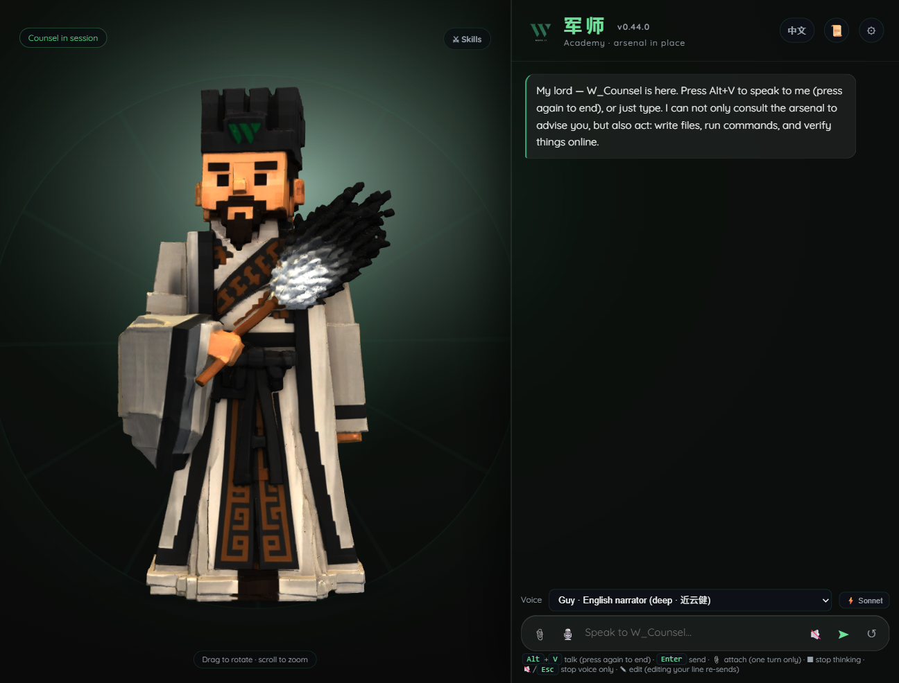

# W_Counsel (军师) — the optional face

  

The **AI Solopreneur OS is the product; W_Counsel is the mascot** — your 军师 (jūnshī, "war-counsel").
Everything in this repo works in plain Claude Code with no mascot at all. W_Counsel is an **optional
shell**: a voice + 3D talking-strategist (诸葛 / Zhuge Liang) that you *speak to*, running the same OS
underneath. ("W" is for Weiss; 军师 is the Chinese name.)

The full app is vendored under [`app/`](app/) — a Node server + web frontend + 3D model. To run it:
`cd app && npm install && npm start`, then open `http://localhost:5174` (see [`app/README.md`](app/README.md)).
This doc explains how the optional W_Counsel shell connects to **this installed OS**.

---

## What W_Counsel is
- A small local app: you talk (mic), it thinks against your data folder, and a 3D figure speaks back.
- **Brain:** the Claude Agent SDK. **Voice:** Edge Read-Aloud voices via Node (`msedge-tts`) — no Python.
  Six voices (mature 中文 narration, Cantonese, Taiwan, English) with a live picker; the default voice
  follows the **中文 / EN** language you pick at setup.
- **Look:** the Weiss design system — brand greens on black, Apple-glass panels, the transparent Weiss logo.
- **Boundary (hard):** it may freely edit **only inside its data folder** (your content dir); everything
  else on your machine is read-only. This mirrors `framework/operating-principles.md` §6.
- **Layout-aware:** it detects whether your content folder is a **flat starter** or a full **AI Solopreneur
  OS** (it looks for `wiki/` + `onboarding/intake.md`) and reads/ingests into the right shape — so pointing
  it at this installed OS Just Works.

## In the app — the controls
The shell is one screen: the 3D 军师 on the left, a chat panel on the right.

- **Composer.** Type, or hold **`Alt`+`V`** to talk (press again to stop & send). **`Enter`** sends,
  **`Shift`+`Enter`** is a newline. Each message has a **✎ edit** (editing *your* line re-asks; editing
  军师's just corrects the text).
- **📎 Attachments — read once, never saved.** Attach a PDF / doc / image / data file; it rides along with
  the next message only, is read for that turn, and the temp copy is deleted afterward. Nothing lands in
  your data folder.
- **Interrupt cleanly.** **🔇 / `Esc`** stops the *voice* only (军师 keeps thinking & working); **⏹ STOP**
  (shown while a turn runs) aborts the *whole* turn; **↺** starts a fresh round (new context).
- **⚔ Skills tray (OS layout only).** A tray of the OS's skills grouped by the four pillars — **战 Campaign ·
  道 The Way · 知 Knowing · 阵 Formation**. Tap a category to reveal its pills; **hover any tab or pill for a
  short description**; tap a pill to drop `/<skill> ` into the composer, then speak or type the rest. Only
  skills that exist on disk show, so the tray mirrors *your* installed OS. A **search box** filters skills
  across all pillars, and a **recent** row surfaces your last-used.
- **🏯 查库 / Arsenal search.** If your content folder (or a separately-configured **Arsenal folder** in
  settings) carries a `tools/wiki-search.py`, a **查库** pill appears: tap it, ask a question, and 军师
  searches that wiki and answers **with `[[page]]` citations** — read-only, never writing to it.
- **Context-window meter + cost.** A small gauge shows how full the model's context is (**amber ~50% · red
  ~80%**); when it fills, 军师 **auto-compacts** (summarizes-and-continues) so the council keeps going —
  **↺** still gives a clean slate. A tiny **$ readout** beside it tracks spend this council.
- **⚡ Sonnet / 🧠 Opus toggle.** A voicebar switch picks fast voice-chat (Sonnet) vs deep counsel (Opus)
  per turn; the choice is remembered.
- **📜 Past councils.** Every conversation is saved on disk (by the Agent SDK), so the **📜** button reopens
  any previous council with its transcript repainted — it survives restarts. Each launch starts fresh; history
  is one tap away.
- **Formatted replies.** 军师's answers render light **markdown** (bold, lists, code, links) in the chat
  panel; the spoken voice is unaffected.

## Connecting Claude (how the brain authenticates) — ToS-clean
The shell uses **your own Claude**, authenticated through Anthropic's own official client (no embedded
OAuth). The ⚙ "Connect Claude" panel opens in your choice of **中文 or English** and leads with:

1. **Sign in via Claude Code / VS Code** — the primary path. The app walks you through it: install
   Claude Code (or the VS Code extension) → run `claude` → `/login` → come back. W_Counsel then reads
   those local credentials via the Agent SDK. (If you're already signed in, it just works.)
2. **API key (clean alternate)** — paste an `sk-ant-…` key. Stored locally on your machine
   (gitignored, never sent to the browser).

> This is the deliberate, ToS-clean design: you authenticate through Anthropic's official client or your
> own API key — the app only provides guidance, it never embeds a consumer-subscription OAuth flow.

## Your content — it points at *your* data, not anyone's vault
W_Counsel reads from a **content folder you own**, resolved in this order: an in-app setting → an env-var
fallback → a bundled **generic Solopreneur-OS starter** copied in on first run (so it works out of the
box). The starter ships `index.md · profile.md · log.md · knowledge/ · HOW-TO-INGEST.md` — it asks who
you are and fills `profile.md`; no one's private data is shipped.

**To make it run *this* OS:** in the app's settings, point its content folder at this installed OS
folder (the packaged build has a native folder-picker). The app also honors an environment-variable
fallback if you prefer to set it that way — the exact variable name is documented in the W_Counsel
app's own README. Set it in the *app's* environment, not in this OS's `.env`.

**Multiple W_Counsel profiles (switch arsenals).** If you run more than one console — say a separate
content folder per brand or business — the ⚙ settings let you **save named profiles** (a name + a folder
path) and switch the active one from a dropdown. Switching re-reads the new folder's shape (flat ↔ OS),
refreshes the skill tray, and starts a fresh round so 军师 re-reads that arsenal cleanly. Profiles are
stored locally in the app's config; no data is copied or shared between them.

## Feed it your knowledge (库 The Arsenal)
W_Counsel can **ingest on command**: say **`入库` / "ingest"** with text, a file, or a link and it writes
a note into `knowledge/`, an `index.md` entry, and a `log.md` line — the same compounding loop as this
OS's **库 Arsenal** (`wiki/`). See the shell's `HOW-TO-INGEST.md`.

## Install & run (Windows)
Three ways, no build step:
1. **Desktop app** — double-click **`军师.app`** (a shortcut to the launcher) → standalone Edge `--app` window.
2. **VS Code** — Run Task → "Launch W_Counsel".
3. **Claude Code** — open the app folder and say "run W_Counsel" (reuses your Claude Code login).

**The distributable (P4, shipped as a portable zip — not Tauri):** `build-dist.ps1` produces
**`W_Counsel-Setup.zip`** (~130 MB) bundling a portable `node.exe` + dependencies. End users:
**unzip → run "Install W_Counsel shortcut.cmd" → desktop `军师.app` → double-click.** Nothing to install
(no Node, Python, or Rust). A true **Tauri** native `.exe` is a planned later upgrade — it needs the
Rust/MSVC toolchain set up, so the current shipped installer is the no-Rust portable build.

## The avatar (`zhuge.glb`)
The 3D model is a heavy binary and is **gitignored** (`w-counsel/models/*.glb`) — bring your own, or use
the shell's turnaround-image fallback. If you own a model you may redistribute, drop it at
`w-counsel/models/zhuge.glb`; otherwise the shell renders the 2D fallback.

> W_Counsel / 诸葛 is the persona and mascot of this OS. You don't need it to run the OS — but if you
> want a war-counsel with a face and a voice, this is the door.
